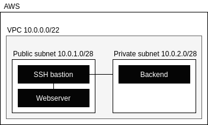

# deploy_it

This repository contains the code for the exercises contained in the `deploy_it` project proposed by Pix4d as a technical interview.

Progress through the different exercises is tagged with `up_to_{exercise}` tags so it is easier to review the code and the progress.

## Notes

### Exercise 2

Although I went through the different exercises in the [Modules section](https://learn.hashicorp.com/collections/terraform/modules) section, no code is included in this repository as the code was already provided in the documentation.

### Exercise 3

To fetch the AMI of the current Ubuntu Server 18.04 I used the aws CLI with the following query:

```
$ aws ec2 describe-images \
    --region eu-west-3 \
    --filters "Name=name,Values=ubuntu/images/hvm-ssd/ubuntu-bionic-18.04-amd64-server-????????" "Name=state,Values=available" \
    --query "reverse(sort_by(Images, &CreationDate))[:1].ImageId" \
    --output text
ami-089d839e690b09b28
```

This exercise uses Ansible to provision the web server with NGINX and a website referenced by a git repository. Although this is not required for the exercise and it could be achieved through a `remote-exec`, it is more convenient as new things are required. It also allows to reprovision the server at any time by using `ansible-playbook`.

### Exercise 4

#### Deployment

I defined a new VPC with two subnets, one private for the backend server and another public for the bastion and the webserver. The webserver is only allowing SSH connections from the bastion though.

<p align="center"></p>

#### Questions

Responding to `What are the options to deploy a SSH public key to the VM instances?`, we could do this in different ways:

* Provisioning the key through Ansible.
* Using [Cloud-Init](https://learn.hashicorp.com/tutorials/terraform/cloud-init).
* Using an `aws_key_pair` resource and adding the `key_name` parameter to the `aws_instance` resource.

From these options I would choose the last one as it's the most straightforward one. Actually, as I needed to test the connectivity to the SSH server running in the nodes and deploy the playbook from the previous exercise, this solution has been implemented.

Regarding the question `Is there a way to extract out-of-band the SSH host key of the VM instances?`, I would contemplate three options:

* Use a `remote-exec` to connect to the VM machine and extract it from the `/etc/ssh` directory. The key could be populated to other nodes using again a `remote-exec` provisioner.
* Use an Ansible playbook that fetches the key and uploads it to another VM.
* Use `ssh-keyscan <ip_of_the_host>` from the VM that needs the host key.

Here, I would go with the last option as it's the cleanest and can be done independently of the Terraform workflow.

Concerning `Why are we asking this question?`, having the bastion key in the backend server is the only way to grant direct connections from the bastion into the backend server. I would not go through this approach and use a proxy jump instead.

As this exercise requires a direct connection from the bastion to the backend server and everything should be fully automated, I added a `remote-exec` in the bastion to move the host key (`/etc/ssh/ssh_host_rsa_key`) into the home of the default user. I also added an Ansible playbook (executed automaticall through the module) to run `ssh-keyscan` in the backend against the private IP of the bastion, adding the content to the `authorized_keys` file.

Again, I discourage putting keys in the bastion. I would use something like the following to jump to the backend server:

```
$ eval $(ssh-agent)
$ ssh-add <key>
$ ssh -J ubuntu@<bastion_ip> ubuntu@<backend_ip>
```

#### Pen testing

To validate that everything is as it should be, I included an Ansible playbook that checks the different IPs and the services listening behind them.

### Exercise 5

Let's Encrypt blacklists `compute-1.amazonaws.com` and doesn't allow to usage IPs. Given that I own a domain, I took the chance to move it to Cloudflare and use Terraform's Cloudflare provider to generate an A record in my domain.
